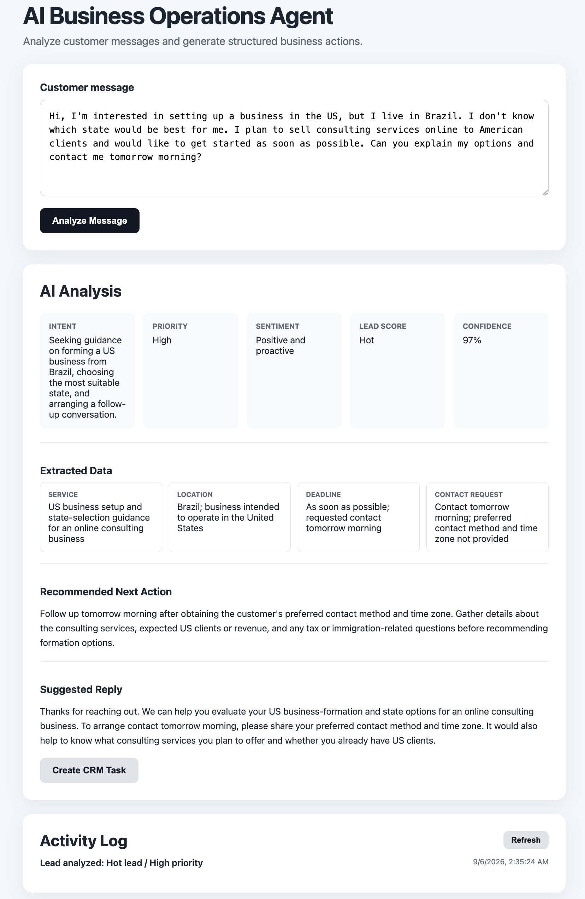

# AI Business Operations Agent

An AI-powered business operations assistant that transforms customer messages into structured, actionable business data.

Built with **Node.js, Express, JavaScript, and the OpenAI API**.

## Live Demo

Try the application:

**https://ai-business-agent-gxk2.onrender.com/**

Enter any customer message to see the AI analyze intent, priority, sentiment, lead quality, extracted data, recommended actions, and generate a suggested response.

## Demo



## What It Does

A customer sends a message. The AI analyzes it and automatically generates:

- Intent classification
- Priority level
- Sentiment analysis
- Lead score
- Confidence score
- Structured data extraction
- Recommended next action
- Suggested customer reply
- CRM follow-up task

The goal is to demonstrate how generative AI can be integrated into a real business workflow — not just used as a chatbot.

## Example

**Customer message**

> Hi, I need help opening an LLC in Florida. I need it done this week and I would like someone to call me today. How much does it cost?

**AI analysis**

| Field | Result |
|---|---|
| Intent | Request assistance forming an LLC in Florida |
| Priority | High |
| Sentiment | Neutral |
| Lead Score | Hot |
| Confidence | 98% |
| Service | Florida LLC formation |
| Location | Florida |
| Deadline | This week |
| Contact Request | Phone call today |

The system then recommends the next business action, generates a customer response, and allows the user to create a simulated CRM follow-up task.

## Architecture

```text
Customer Message
       │
       ▼
Web Interface
HTML / CSS / JavaScript
       │
       ▼
Node.js + Express
       │
       ▼
OpenAI Responses API
       │
       ▼
Structured JSON Output
       │
       ├── Intent
       ├── Priority
       ├── Sentiment
       ├── Lead Score
       ├── Confidence
       ├── Extracted Data
       ├── Next Action
       └── Suggested Reply
       │
       ▼
CRM Task Simulation
       │
       ▼
Activity Log
```

## AI Engineering

The application uses **Structured Outputs with JSON Schema** rather than relying on free-form AI responses.

This produces predictable data that can be validated and passed to downstream systems such as CRMs, databases, automation platforms, and external APIs.

### Guardrails

The agent is instructed not to invent business-specific information such as:

- Prices or fees
- Policies
- Availability
- Deadlines
- Guarantees
- Contact information

When required information is missing, the AI asks for clarification rather than fabricating business facts.

## Technology Stack

- JavaScript
- Node.js
- Express
- OpenAI API
- OpenAI Responses API
- Structured Outputs / JSON Schema
- REST APIs
- HTML
- CSS

## CRM & Automation

The current MVP simulates CRM task creation and records activity in an in-memory log.

The same architecture can be connected to real systems such as HubSpot, Salesforce, Kommo, Pipedrive, Make.com, Zapier, or custom APIs.

## Run Locally

### 1. Clone the repository

```bash
git clone YOUR_REPOSITORY_URL
cd ai-business-agent
```

### 2. Install dependencies

```bash
npm install
```

### 3. Configure the OpenAI API key

Create a `.env` file:

```text
OPENAI_API_KEY=your_openai_api_key
```

### 4. Start the application

```bash
node server.js
```

Open:

```text
http://localhost:3000
```

## Security

The OpenAI API key is stored server-side and is never exposed to the browser.

The `.env` file is excluded from Git and should never be committed to the repository.

## Project Status

**MVP complete.**

This project was intentionally kept focused to demonstrate practical skills in:

- AI API integration
- Structured LLM outputs
- Prompt engineering
- Hallucination guardrails
- REST API development
- Business workflow automation
- Frontend/backend integration

Potential production extensions include persistent storage, authentication, real CRM integration, WhatsApp/email automation, company knowledge bases, and RAG.

## Author

**Wilson Ribeiro**